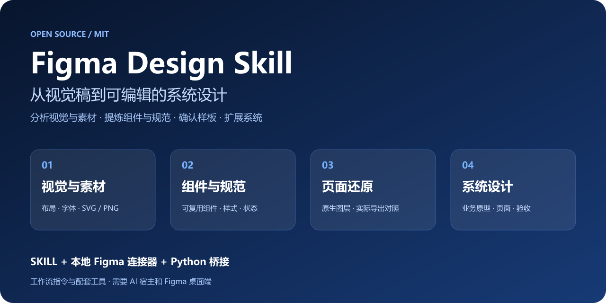
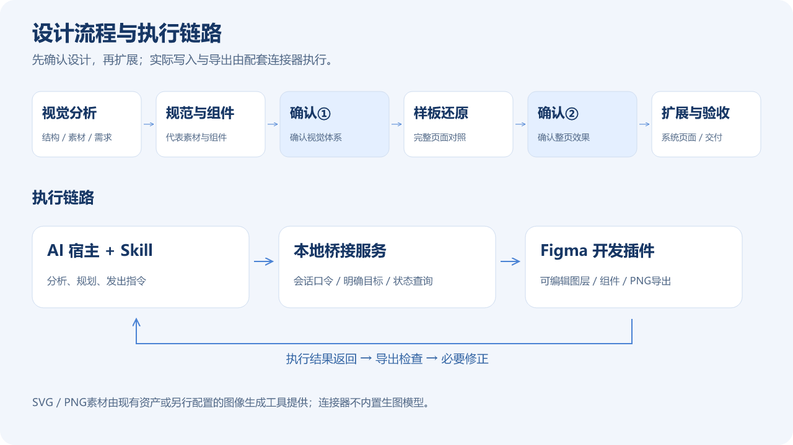

# Figma Design Skill



**把一张视觉稿，转成有规范、有组件、可编辑的 Figma 设计，再延续成一致的系统页面。**

这是面向 AI 设计协作的中文 Skill，现已配套提供自有 Figma 开发插件、Python 本地桥接服务和指令客户端。Skill负责设计方法，连接器负责读写Figma；它不是单独安装后即可运行的AI模型或自动设计应用。

[安装与连接](文档/安装与连接.md) · [接口与排错](文档/接口与排错.md) · [版本与限制](文档/发布说明.md) · [核心Skill](skills/figma-design/SKILL.md)

## 适合什么场景

- 已有视觉稿，希望还原为可编辑的Figma页面。
- 希望先确定组件、规范及素材，再开始批量设计。
- 已有代表页面，希望按原型或业务需求扩展系统。
- 多轮修改后，需要检查全局一致性、字段完整性及交付质量。

## 核心能力

| 能力 | 内容 |
|---|---|
| 视觉分析 | 结构、层级、字体、颜色、间距及重复模式 |
| 素材制作 | 优先复用；按质感选择SVG或PNG，生成素材需要额外可用工具 |
| 规范与组件 | 样式、必要属性与状态、内容伸缩及实际复用 |
| 页面还原 | 原生图层、完整样板页、实际Figma导出对照 |
| 系统扩展 | 根据业务依据设计页面、必要状态及适配规则 |
| 验收交付 | 尺寸、遮挡、功能字段、组件结构、关联页面及最新预览 |

## 工作流程



确认过的决定持续复用，局部修改不强制重走全部阶段。只有视觉稿而没有业务依据时，不自行编造整个系统功能。

## 三部分如何配合

| 部分 | 职责 |
|---|---|
| `skills/figma-design` | 告诉AI如何分析、设计、还原和验收 |
| `连接器/桥接服务.py`、`发送指令.py` | 本机传输指令、验证会话口令、明确目标及查询状态 |
| `连接器/manifest.json`、`执行器.js`、`面板.html` | Figma内读取／修改节点、创建组件、导入素材、导出PNG |

这不是MCP服务器。宿主需要能运行本机客户端或访问本地HTTP；Figma插件需要通过开发模式导入。Skill也可以使用其他兼容的Figma工具，不强制绑定本连接器。

## 快速开始

1. 下载仓库，将 `skills/figma-design` 复制到宿主的个人技能目录；已有同名技能先备份并合并。
2. 使用Python 3.10+启动 `python 连接器/桥接服务.py`。
3. 在Figma桌面端通过开发插件菜单导入 `连接器/manifest.json`。
4. 将终端会话口令粘贴到插件面板，点击连接。
5. 按[安装文档](文档/安装与连接.md)设置客户端环境变量，运行 `--clients` 和只读检查。
6. 在独立测试文件运行创建样板示例，核对可编辑节点及导出，再用于正式任务。

```text
使用 $figma-design，分析我提供的视觉稿。
先制作设计规范、代表组件和必要素材，给我确认；
再还原完整样板页，确认后按业务原型扩展其他页面。
使用本仓库的配套连接器，仅修改我指定的Figma分区。
```

告知AI仓库位置、目标文件／分区、参考稿、尺寸约束和业务原型。会话口令由环境变量传给客户端，不要发布到聊天截图或GitHub。

## 仓库结构

```text
skills/figma-design/  通用Skill与按需参考资料
连接器/               开发插件、桥接服务与客户端
示例/                 只读检查、创建样板请求
测试/                 桥接HTTP与执行器模拟测试
文档/                 安装、接口、排错与发布范围
素材/                 原创SVG封面和流程图
```

## 当前成熟度

**v0.2.0 配套连接器预览版。** 原执行器来自实际设计工作，新开源版增加了认证和超时恢复。桥接与执行器自动测试已通过，但新版本尚未完成Figma桌面端端到端联调；先在独立文件验证，不宣称所有环境开箱即用。

- 只监听本机回环地址，插件手动连接，数据接口需会话口令。
- 不执行任意JS；支持的节点／组件／样式操作见[接口文档](文档/接口与排错.md)。
- 不提供变量创建、原型连线、AI模型、图像生成服务、代码开发或部署。
- 不包含客户设计、私有项目记录、外部字体或商业素材，不保证任意视觉稿都像素级一致。

## 贡献与许可

欢迎提交Issue或PR，请给出可复现步骤、宿主环境、预期与实际结果，并移除客户信息和口令。项目特例保存在各自项目中，不硬编码进通用规则。

[MIT许可证](LICENSE)覆盖本仓库代码、文档及原创配图；不授予外部字体、品牌或用户素材权利。本项目非Figma或OpenAI官方出品。
